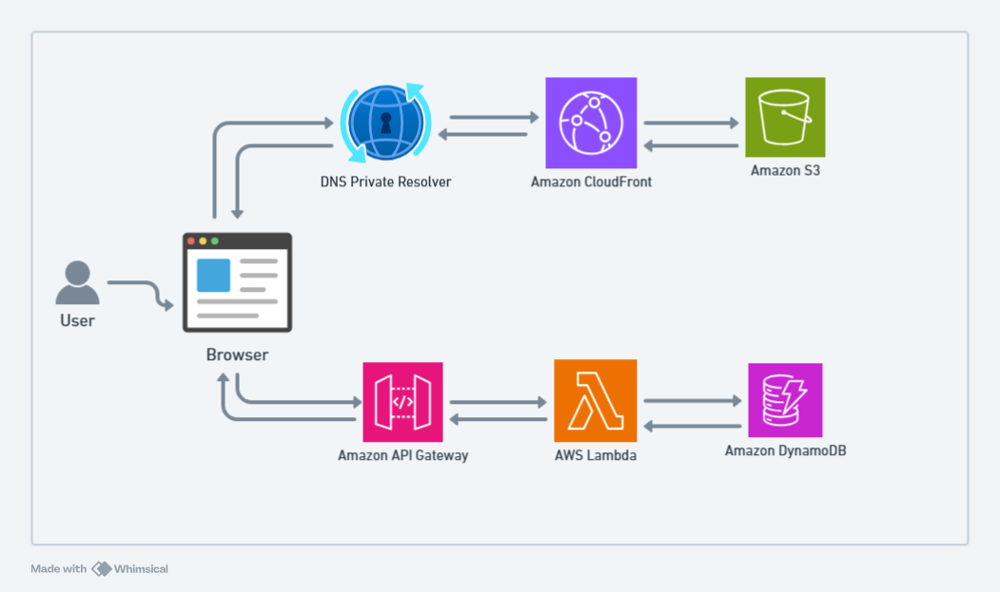

# **AWS Terraform Project** 

<p align="center">
  
</p>

This repository showcases the amazing potential of **Infrastructure as Code (IaC)** with **Terraform**, enabling the deployment of a powerful and scalable backend for my personal website. 🚀

Here’s what’s happening under the hood:  
We’re creating an **API endpoint** that integrates seamlessly with the website. The infrastructure includes:  
- An **AWS Lambda function** for backend processing.  
- A **DynamoDB table** to handle data storage.  
- An **API Gateway** to tie it all together and expose the API to the world.  

All of this magic is fully automated with **GitHub Actions**, ensuring a smooth and efficient CI/CD pipeline.

This project is also a part of my contribution to the **Cloud Resume Challenge** 🎓 You can check out my live website [here](https://www.sakethpokuri.com/) to see it all in action.


---

## **Project Architecture** 🏗️

### Deployed AWS Resources:

1. **AWS Lambda Function**: Processes API requests.
2. **DynamoDB Table**: Stores backend data for the application.
3. **API Gateway**: Exposes APIs to integrate with the website.

### Tools Used:
- **Terraform**: Infrastructure as Code (IaC) tool for managing AWS resources.
- **GitHub Actions**: CI/CD pipeline for automating Terraform workflows.


---

## **Project Structure** 📂

1. **Root Terraform Files**: Core configuration files for the Terraform setup:
   - `main.tf`: Defines the primary resources and configurations.
   - `outputs.tf`: Specifies output values for the Terraform state.
   - `provider.tf`: Configures the AWS provider.

2. **Modules**: Modularized Terraform configurations for better reusability:
   - `lambda/`: Manages the AWS Lambda function.
   - `dynamodb/`: Configures the DynamoDB table.
   - `api_gateway/`: Sets up the API Gateway.

3. **GitHub Actions**: Contains the workflow file for CI/CD.

---

## **Setup and Deployment** ⚙️

Follow these steps to set up and deploy the infrastructure:

### 1. **GitHub Actions Secrets**:
Ensure the following secrets are configured in your repository's **Settings > Secrets and Variables > Actions**:
- `AWS_DEFAULT_REGION`
- `AWS_ACCESS_KEY_ID`
- `AWS_SECRET_ACCESS_KEY`

### 2. **Remote Terraform State Backend**:
To enable remote state management and locking, create the following AWS resources **before running Terraform**:
- **S3 Bucket**: Stores the Terraform state file.
- **DynamoDB Table**: Manages state locking to prevent race conditions.

Example Terraform backend configuration:
```hcl
terraform {
  backend "s3" {
    bucket         = "terraform-state-bucket-2000"
    key            = "terraform.tfstate"
    dynamodb_table = "terraform-state-lock"
    region         = "eu-north-1"
  }
}
```

### 3. **Deploy the Infrastructure**:
Run the following commands to deploy:
```bash
terraform init
terraform plan
terraform apply -auto-approve
```

---

## **CI/CD Pipeline** 🔄

This project uses **GitHub Actions** to automate infrastructure deployment. The workflow file ensures:
1. **Terraform Linting and Formatting**: Validates code structure.
2. **Plan and Apply**: Provisions AWS resources using Terraform.
3. **Destroy**: Tears down the infrastructure when the workflow is completed.
<!-- 4. **File-Based Flag Triggers**: The deployment and destruction workflows are controlled by the content of the deploy.flag file:
    - If deploy.flag is set to true, the deployment workflow triggers and creates the infrastructure.
    - If deploy.flag is set to false, the destruction workflow triggers and tears down the infrastructure -->
